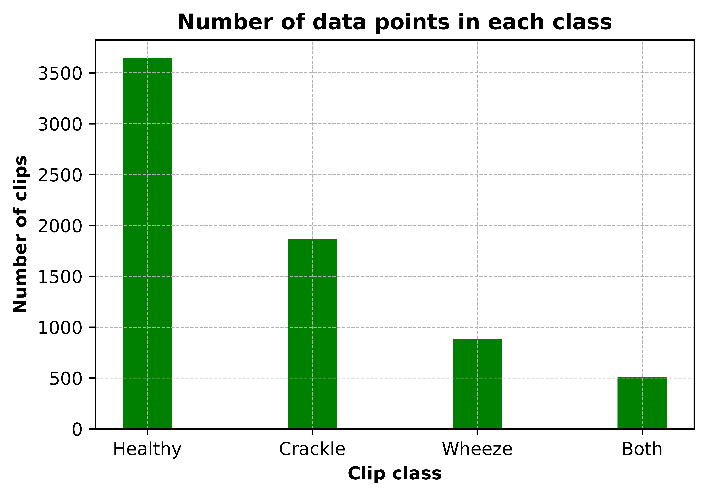
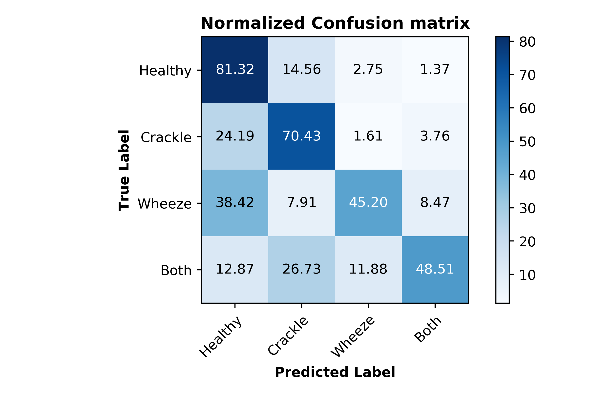

# Detecting Respiratory Disorders

## CS 7651 - Machine Learning (Team 7)

# Introduction

# Data

Data is taken from the _Respiratory Sound Database_ created by two research teams in Portugal and Greece. It consists of 920 recordings. Each recording is varying in length. A scatter plot of the length of recordings is given in **FIGURE**. Recordings were taken from 126 patients and each recording is annotated. Annotations are comprised of beginning and end times of each respiratory cycle and whether the cycle contains crackle and/or wheeze. Crackles and wheezes are called adventitious sounds and presence of them are used by health care professionals when diagnosing respiratory diseases. Number of respiratory cycles containing each adventitious cycle is shown in **PLOT**.

## Preprocessing

Preprocessing of the data starts from importing the sound files, resampling and cropping them. Since the recordings were taken by two different research teams with different recording devices, there are 3 different sampling rates (44100 Hz, 10000 Hz and 4000 Hz). All recordings were resampled to 44100 Hz and all clips are made 5 seconds long by zero padding shorter clips and cropping the longer ones.  `librosa` library was used in this project for reading the audio data and extracting features.

### Feature Extraction (MFCC)

Mel Frequency Cepstrum Coefficients were used as features of the sound clips. MFCCs are widely used in speech recognition systems. They are also being used extensively in previous work on detection of adventitious respiratory sounds, they provide a measure of short term power spectrum of time domain signals. Both the frequency and time content are important to distinguish between different adventitious sounds, since different adventitious sounds can exist in a single clip at different time periods and they differ in duration. Therefore, MFCC is helpful in capturing the change in frequency content of a signal over time. Frequencies are placed on a mel scale, which is a nonlinear scale of frequencies whose distances are percieved to be equal by the human auditory system. Output of MFCC is a 2 dimensional feature vector (time and frequency), which was then flattened into a one dimensional array before further processing.  

A sample output from MFCC content of clips containing different adventitious sounds is given below.

**FIGURE**

### Dimension Reduction (Applying PCA)

The MFCC-based features exist in a 2-dimensional space where the first and second dimensions represent the time and frequency information, respectively. Hence, the   input data $\mathbf{x}_i \in \mathbb{R}^{TxD}$ where $T$ is the number of time-windows and $D$ is the number of frequency bins. As can be seen in the figures above, the features are sparsely distributed and most of these features show similar charachteristics across different classes. This implies that the dataset contains significant amount of redundant features. In an effort to reduce the dimensionality of the dataset and hence increase the learning rate while keeping the variation within the dataset, we propose to utilize principal component analysis (PCA).

PCA is a commonly used unsupervised learning technique in machine learning that projects the dataset into a lower dimensional dataset in an optimal manner that maximizes the remained variance. PCA performs a linear transformation and is therefore useful for datasets that are linearly seperable. In conventional PCA application, the input data for each sample is represented as a vector (1-dimensional). Therefore, the whole dataset can be represented as a 2-dimensional matrix that consists the stacked input vectors. Firstly, the dataset is centered to avoid a biased projection. Later, the centered data matrix is expressed in singular value decomposition form. The projection is performed by keeping the largest singular values and their corresponding eigenvectors. The number of the singular values that are utilized can be determined manually or can be chosen so that the explained variance of the original dataset achieves a certain threshold.

Our MFCC-based features lie in a 2-dimensional space. To be able to utilize the conventional PCA scheme, we flatten the features so that the features are represented as a vector. Then, we can apply the common PCA procedure. However, PCA is not agnostic to different scalings of the features. Therefore, we standardize the data so that all features are similarly scaled.

To give a perspective of the dimensions, when the maximum length of the recording are limited to $5$ seconds, the resulting MFCC features have the dimension $20\times431$. Therefore, we have 8620 features in total. As explained above, the values for most of these features are the same across the different classes and redundant. In the figure below, how the explained cumulative variance changes for increasing number of components is presented. We note that we still keep the $99\%$ of the original variance when the dimensionality is reduced to $1916$. This reduction is very significant because it becomes useful to increase the learning rate in the next step.

<a style='text-decoration: none; font-weight: bold; color: black;'>
  
  
Fig.1: Explained variance for increasing number of kept principal components.

</a>

# Classification Methods
## Support Vector Machines (SVM)
## Concurrent Neural Networks (CNN)

# Evaluation & Results
## SVM Results

Our best SVM model achieved an accuracy of 69%. Interestingly, the recall percentages correlate well with the distribution of classes in our data. When looking at the unbalanced dataset, as less training data was available in each class, the corresponding recall values also decreased. Figure 0 is the confusion matrix with percent recall values, and figure 1 illustrates this by normalizing the number of clips in each class and the recall of each class.

-> Figure 0. Normalized confusion matrix for SVM model <-

-> Figure 1. Comparison of normalized class distribution and normalized recall for each class in SVM model <-

The unbalanced data could be the reason for our relatively low accuracy of 69%. The healthy class, which had the most data available (3642 clips) achieved a recall of 82%, while the both class, with the least data available (506 clips) achieved a recall of 37%.

## CNN Results

Our best CNN model achieved an accuracy of 71%. The normalized confusion matrix is shown in Figure 2, and a graph of the training and validation accuracy is shown in Figure 3.

-> Figure 2. Normalized confusion matrix for CNN model <-

-> Figure 3. Training and validation accuracy for CNN model across 30 epochs <-

As seen in Figure 3, overfitting starts to happen at around the 20th epoch. Although more training at each epoch does result in a higher validation accuracy, the accuracy gain is much less when compared to the training accuracy.

Like the SVM model, the recall percentages for the CNN model also correlate well with the distribution of classes in our data. The graph of the normalized class distribution and recall comparison is shown in Figure 4.

-> Figure 4. Comparison of normalized class distribution and normalized recall for each class in CNN model <-

## Dataset Evaluation
The dataset itself was a difficult dataset to work with. Aside from the unbalanced part of it that was discussed previously, there were various other features that could affect our accuracies.

One aspect of the data that likely reduced our accuracy was the format of the data itself. All the clips were of different lengths, ranging from 0.2 to 16.2 seconds. The clips were also not sampled at the same sampling rate. This required us to augment the data through zero-padding, cropping, filtering, and up-sampling or down-sampling, which removed from the truth of the actual data and could cause problems in the training process.

Another aspect of the data that could have reduced our accuracy was how the data was gathered. Across all the clips, there were four different recording devices used, two different acquisition modes, and six different locations of the chest that were recorded. Our models did not account for any of these differences.

# Discussion & Conclusion

# References
